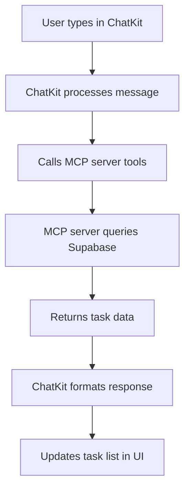

# ChatKit + MCP Integration Setup

This guide shows you how to set up ChatKit with your MCP server for an integrated AI chat experience in your task manager.

## 🎯 **What This Gives You**

- **AI Chat Button**: Floating button in your task manager
- **Natural Language**: "Create a task to call mom tomorrow"
- **Real-time Updates**: Tasks created via chat appear instantly in your app
- **Full Integration**: No need to switch between apps

## 🚀 **Setup Steps**

### **Step 1: Configure MCP Server**

1. **Get your Supabase service role key:**
   ```bash
   # Go to: https://supabase.com/dashboard/project/ihheipfihcgtzhujcmdn/settings/api
   # Copy the "service_role" key
   ```

2. **Update MCP server config:**
   ```bash
   cd mcp-server
   # Edit config.js and replace YOUR_SERVICE_ROLE_KEY_HERE with your actual key
   ```

3. **Test the MCP server:**
   ```bash
   npm start
   # Should show: "Task Manager MCP server running on stdio"
   ```

### **Step 2: Configure Web App**

1. **Add environment variables:**
   ```bash
   cd web
   # Create .env file with:
   echo "REACT_APP_OPENAI_API_KEY=your_openai_api_key_here" > .env
   echo "REACT_APP_MCP_SERVER_URL=http://localhost:3001" >> .env
   ```

2. **Install dependencies (already done):**
   ```bash
   npm install @openai/chatkit
   ```

3. **Start the web app:**
   ```bash
   npm run dev
   ```

### **Step 3: Test the Integration**

1. **Open your task manager:** http://localhost:5174/
2. **Look for the floating AI button** (bottom right)
3. **Click it and try these commands:**
   - "Show me my tasks today"
   - "Create a high priority task called 'Call mom' for tomorrow"
   - "What P1 tasks do I have?"

## 🛠 **How It Works**



## 💡 **Example Conversations**

### **Creating Tasks**
```
User: "Create a task to buy groceries tomorrow with priority P2"
AI: "✅ Task created: Buy groceries (P2, due tomorrow)"
→ Task appears in your task list
```

### **Viewing Tasks**
```
User: "What tasks do I have today?"
AI: "You have 3 tasks today:
- Call mom (P1)
- Buy groceries (P2)
- Review project docs (P3)"
```

### **Updating Tasks**
```
User: "Mark my grocery task as completed"
AI: "✅ Marked 'Buy groceries' as completed"
→ Task disappears from open tasks
```

## 🔧 **Troubleshooting**

### **MCP Server Issues**
```bash
# Check if server is running
curl http://localhost:3001/health

# Restart server
cd mcp-server
npm start
```

### **ChatKit Not Connecting**
- Verify OpenAI API key in `.env`
- Check browser console for errors
- Ensure MCP server is running on port 3001

### **Tasks Not Appearing**
- Check Supabase service role key in `config.js`
- Verify database connection
- Check browser network tab for API errors

## 🎨 **Customization**

### **Change AI Personality**
Edit `web/src/config/chatkit.ts`:
```javascript
systemPrompt: `You are a friendly task management assistant...`
```

### **Add More Tools**
Edit `mcp-server/index.js` to add new functions:
```javascript
{
  name: 'delete_task',
  description: 'Delete a task',
  // ... function definition
}
```

### **Styling**
Edit `web/src/components/chat/AIChat.tsx` for custom styling.

## 🚀 **Deployment**

### **MCP Server**
Deploy to a cloud service (Railway, Render, etc.):
```bash
# Add environment variables
SUPABASE_URL=https://ihheipfihcgtzhujcmdn.supabase.co
SUPABASE_SERVICE_ROLE_KEY=your_key_here
```

### **Web App**
Deploy to Vercel/Netlify with environment variables:
```bash
REACT_APP_OPENAI_API_KEY=your_key_here
REACT_APP_MCP_SERVER_URL=https://your-mcp-server.railway.app
```

## 🎉 **Benefits**

| Feature | ChatKit + MCP | Custom GPT | Manual |
|---------|---------------|------------|---------|
| **Integration** | ✅ Native | ❌ External | ❌ Manual |
| **Real-time** | ✅ Instant | ❌ Sync needed | ✅ Manual |
| **Create tasks** | ✅ Natural language | ❌ Read-only | ✅ Manual |
| **Update tasks** | ✅ Chat commands | ❌ Read-only | ✅ Manual |
| **UX** | ✅ Seamless | ❌ Switch apps | ❌ Multiple clicks |

## 📱 **Mobile Support**

The AI chat works on mobile too! The floating button is touch-friendly and the chat interface is responsive.

---

**Ready to test?** Start both servers and try chatting with your AI assistant! 🚀

