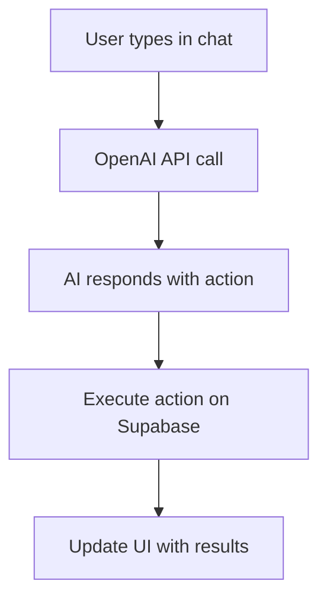

# Simple AI Chat Integration

This is a much simpler approach that integrates AI chat directly into your task manager without the complexity of MCP servers or ChatKit.

## 🎯 **What This Gives You**

- **AI Chat Button**: Floating button in your task manager
- **Natural Language**: "Create a task to call mom tomorrow"
- **Real-time Updates**: Tasks created via chat appear instantly in your app
- **Full Integration**: No external servers needed

## 🚀 **Setup Steps**

### **Step 1: Add OpenAI API Key**

Create a `.env` file in the `web` directory:

```bash
cd web
echo "VITE_OPENAI_API_KEY=***REMOVED_OPENAI_KEY***" > .env
```

### **Step 2: Start the Web App**

```bash
cd web
npm run dev
```

### **Step 3: Test the Integration**

1. **Open your task manager:** http://localhost:5174/
2. **Look for the floating AI button** (bottom right)
3. **Click it and try these commands:**
   - "Show me my tasks today"
   - "Create a high priority task called 'Call mom' for tomorrow"
   - "What P1 tasks do I have?"

## 🛠 **How It Works**



The AI assistant:
1. **Understands natural language** requests
2. **Calls Supabase directly** to get/create/update tasks
3. **Formats responses** in a user-friendly way
4. **Triggers UI updates** when tasks are created/modified

## 💡 **Example Conversations**

### **Creating Tasks**
```
User: "Create a task to buy groceries tomorrow with priority P2"
AI: "✅ Task created successfully!

Title: Buy groceries
Priority: P2 (High)
Due Date: 2025-10-15"

→ Task appears in your task list
```

### **Viewing Tasks**
```
User: "What tasks do I have today?"
AI: "Here are your tasks:

• Call mom (P1) - Due: 2025-10-14 - Project: No Project
• Buy groceries (P2) - Due: 2025-10-14 - Project: No Project
• Review project docs (P3) - Due: 2025-10-14 - Project: No Project"
```

### **Updating Tasks**•
```
User: "Mark my grocery task as completed"
AI: "✅ Task updated successfully!

Buy groceries is now completed"

→ Task disappears from open tasks
```

## 🔧 **Available Actions**

The AI can perform these actions:

- **`get_tasks`** - Show all tasks with details
- **`create_task`** - Create new tasks with title, description, priority, due date
- **`update_task`** - Mark tasks as completed or change status
- **`get_projects`** - List all projects

## 🎨 **Features**

- **Natural Language Processing**: Understands conversational requests
- **Context Awareness**: Knows about existing tasks when making decisions
- **Real-time Updates**: Changes appear immediately in the UI
- **Error Handling**: Graceful error messages if something goes wrong
- **Mobile Responsive**: Works great on phones and tablets

## 🔧 **Troubleshooting**

### **AI Not Responding**
- Check that your OpenAI API key is valid
- Verify the `.env` file is in the `web` directory
- Check browser console for errors

### **Tasks Not Appearing**
- Ensure you're logged into the app (Supabase auth required)
- Check that your Supabase project is active
- Verify database tables exist

### **API Errors**
- Check OpenAI API usage limits
- Verify Supabase connection
- Check browser network tab for failed requests

## 🚀 **Benefits Over MCP/ChatKit**

| Feature | Simple AI Chat | MCP/ChatKit |
|---------|----------------|-------------|
| **Setup Time** | ✅ 5 minutes | ❌ 30+ minutes |
| **Dependencies** | ✅ Minimal | ❌ Complex |
| **Reliability** | ✅ Direct API calls | ❌ Server dependencies |
| **Debugging** | ✅ Easy to troubleshoot | ❌ Complex stack |
| **Maintenance** | ✅ Self-contained | ❌ Multiple services |

## 📱 **Mobile Support**

The AI chat is fully responsive and works great on mobile devices:
- Touch-friendly interface
- Responsive design
- Keyboard support

## 🎉 **Ready to Use**

This approach gives you all the benefits of AI-powered task management without the complexity. Just add your OpenAI API key and you're ready to go!

**Test it now:** Start your web app and click the floating AI button! 🚀
